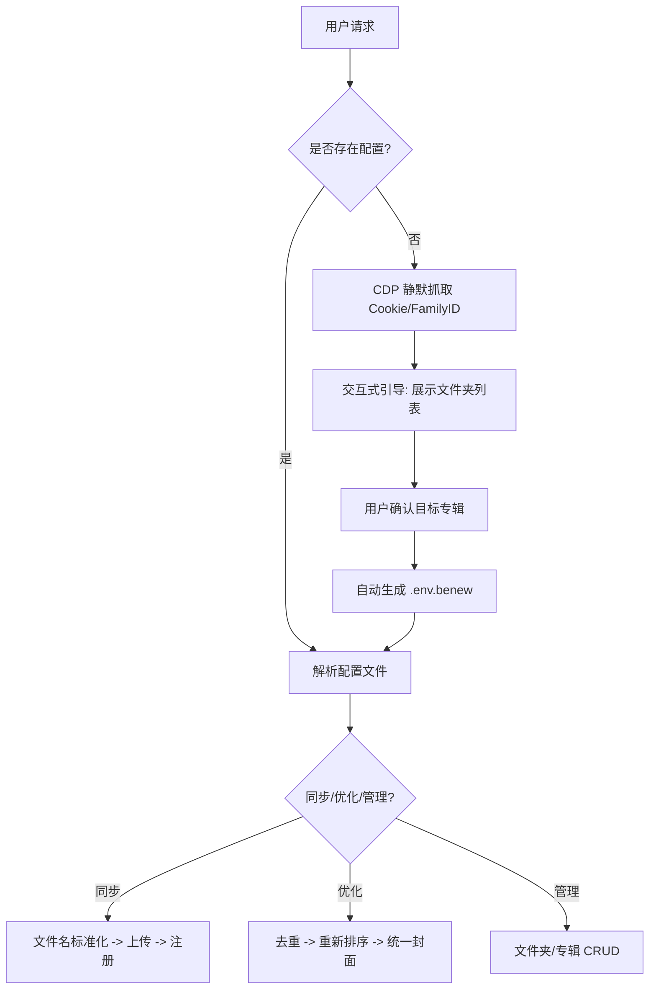

# 本牛云盘 AI 助手项目演进全景记录

本项目记录了从原始 Python 同步脚本演进为高度集成、可交互的 **AI Agent Skill** 的全过程。

---

## 1. 项目背景与目标 🏁

最初，本项目仅包含基础的本牛云盘音频同步和优化脚本（硬编码 Cookie 和 ID）。
**终极目标：** 打造一个无须用户手动配置（零配置）、具备云端管理能力、且能让 AI 助理通过自然语言完全接管的“云盘大脑”。

---

## 2. 演进里程碑 (Timeline) 📅

### 第一阶段：浏览器黑盒探索与 API 解密
- **核心动作**：利用智能浏览器子代理，在不查阅文档的情况下，通过流量拦截和 DOM 分析，成功复现了本牛云盘前端的所有核心接口。
- **获取能力**：
  - 根目录文件夹列表提取。
  - 专辑 CRUD (新建、改名、删除) 隐蔽接口。
  - 文件夹管理 CRUD 接口。

### 第二阶段：从“僵死脚本”到“动态工具”
- **脚本开发**：
  - 编写了 `get_benew_folders.py` 和 `benew_album_crud.py` 等验证脚本。
  - 实现了文件名标准化逻辑（清洗 `(1)` 等冗余标记）。
- **自动化突破**：成功研发了基于 **CDP (Chrome DevTools Protocol)** 的凭证抓取方案，能够静默接管用户当前的 Chrome 状态，告别手动 F12 复制 Cookie。

### 第三阶段：Skill 整合与交互升级
- **架构重组**：打破了原有的“外层乱放脚本”模式。
- **Skill 建模**：
  - 定义了 `benew-album-manager` 的 `SKILL.md`。
  - 引入了**“交互式配置引导 (Interactive Flow)”**。当 AI 发现配置缺失时，会引导用户从文件夹列表中点选，而非强迫用户寻找链接。
- **安全加固**：建立了核心文件夹（如 "Knock Knock 世界"）的保护机制。

### 第四阶段：工程化规范与公开化
- **清理整顿**：删除所有临时验证性脚本，将所有能力收纳进标准化目录。
- **仓库标准化**：
  - 将 Skill 移至一级目录，删除 `.agent` 冗余层级。
  - 远程仓库更名为 `skills`。
  - 强化 `.gitignore`，彻底物理销毁本地及 Git 历史中的 `.env.benew` 敏感文件。
  - **最终成果**：正式将仓库设置为 **Public (公开)**。

---

## 3. 核心技术栈与逻辑流程 🛠️

### 逻辑流转图 (Mermaid)

### 关键组件
1.  **`cloud_manager.py`**：技能的“躯干”，负责所有云端资产的生命周期。
2.  **`sync.py` & `optimize.py`**：技能的“手臂”，负责沉重的音频传输与整理工作。
3.  **`get_cookie_cdp.py`**：技能的“触角”，负责静默感知用户的环境状态。

---

## 4. 后续展望 🚀
本项目现已作为 `leavingme/skills` 公开。它不仅是一个音频同步工具，更是一个研究 **“如何将传统爬虫/脚本转化为 AI 友好型 Skill”** 的标准范例。未来可进一步扩展至其他云盘或垂直领域的资产管理。

---
*记录人：Antigravity*
*记录时间：2026-03-11*
